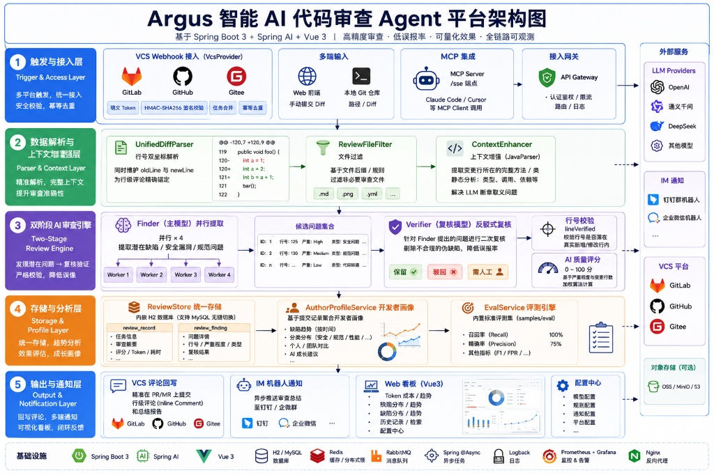

# Argus — AI 代码审查 Agent

[English](README.md) | **简体中文**



> Docker Compose 默认启用 Mock 模式，无需 API Key 即可体验完整审查流程。

Argus 是一个基于 **Spring Boot 3、Spring AI 和 Vue 3** 的自托管 AI 代码审查平台。它可以审查手动提交的 unified diff 或本地 Git 仓库，也可以通过 GitLab、GitHub、Gitee Webhook 自动审查 PR/MR，并将问题以行级评论或 Markdown 总结回写到代码托管平台。

项目内置 Finder–Verifier 两阶段误报治理、JavaParser 上下文增强、代码质量评分、开发者画像、效果评测、统计看板、MCP Server 和 IM 通知。审查记录默认使用文件模式 H2，Webhook 异步任务由 RabbitMQ 持久化承载。



## 目录

- [核心能力](#核心能力)
- [工作流程](#工作流程)
- [技术栈](#技术栈)
- [快速开始](#快速开始)
- [配置](#配置)
- [平台集成](#平台集成)
- [MCP 接入](#mcp-接入)
- [页面与 API](#页面与-api)
- [设计要点](#设计要点)
- [测试](#测试)
- [公开评测](#公开评测)
- [Roadmap](#roadmap)
- [常见问题](#常见问题)

## 核心能力

| 模块 | 能力 |
| --- | --- |
| 多通道接入 | Web UI 粘贴 diff、本地仓库审查、GitLab/GitHub/Gitee Webhook、MCP 工具调用 |
| 审查引擎 | unified diff 解析、文件过滤、文件级并行审查、问题分类、严重程度与置信度输出 |
| 上下文增强 | 使用 JavaParser 提取 Java 变更行所在的完整方法，解析失败时自动降级为 diff 审查 |
| 误报治理 | Finder 发现问题，Verifier 进行反驳式复核，最后校验问题行号是否属于真实新增行 |
| 结果输出 | PR/MR 行级评论、Markdown 总结、Web 审查详情、钉钉/企业微信机器人通知 |
| 质量度量 | 0～100 代码质量评分、Token 统计、召回率/精确率评测、统计看板 |
| 开发者画像 | 按提交人聚合评分趋势、问题分类、能力标签和 AI 成长建议 |
| 运行控制 | 运行时配置、机密字段掩码、访问令牌、每日 Token 预算、Mock 模式 |

> 项目自带小型评测集。本次发布仅公开可复现的 Mock 链路基线，不宣称真实模型效果；详见[公开评测](#公开评测)。

## 工作流程

```text
手动 diff / 本地 Git 仓库 / VCS Webhook / MCP
                         │
                         ▼
              UnifiedDiffParser 解析变更
                         │
                         ▼
                ReviewFileFilter 过滤
                         │
                         ▼
            ContextEnhancer 补充方法上下文
                         │
                         ▼
              Finder 并行发现潜在问题
                         │
                         ▼
             Verifier 复核并过滤误报
                         │
                         ▼
            校验新增行号、汇总评分与报告
                         │
          ┌──────────────┼──────────────┐
          ▼              ▼              ▼
       Web 看板      PR/MR 评论回写     IM 通知
```

Webhook 请求会快速返回 `202 Accepted`，实际审查由 RabbitMQ 异步执行。同一 commit 会通过持久化审查记录幂等去重；消费失败自动重试三次，耗尽后进入死信队列。

## 技术栈

### 后端

- Java 17
- Spring Boot 3.5
- Spring AI 1.0
- Spring Web / Spring Data JPA
- H2 文件数据库
- JavaParser
- Spring AI MCP Server

### 前端

- Vue 3
- Element Plus
- Vue Router
- Axios
- Vite 6

## 快速开始

### Docker 一键启动（推荐）

安装 Docker Engine 和 Compose 插件后运行：

```bash
git clone <repository-url>
cd Argus
docker compose up --build -d
```

打开 <http://localhost:18080>。Compose 默认设置 `ARGUS_LLM_MOCK=true`，无需模型密钥。使用真实的 OpenAI 兼容模型时：

```bash
ARGUS_LLM_MOCK=false \
ARGUS_LLM_BASE_URL=https://api.deepseek.com \
ARGUS_LLM_API_KEY=replace-me \
ARGUS_LLM_MODEL=deepseek-chat \
  docker compose up --build -d
```

停止服务使用 `docker compose down`；如需同时删除 Argus、报告和 RabbitMQ 数据卷，使用 `docker compose down --volumes`。公网或局域网部署前请修改 RabbitMQ 默认密码并设置 `ARGUS_ACCESS_TOKEN`。

### 本地开发环境要求

- JDK 17+
- Maven 3.6+
- Node.js 18+ 和 npm 9+（仅构建或开发前端时需要）
- Git（审查本地仓库时需要）
- RabbitMQ 3.8+（推荐 RabbitMQ 4；可直接使用仓库中的 Compose 配置）

先启动 RabbitMQ：

```bash
docker compose up -d rabbitmq
```

管理控制台为 <http://localhost:15672>，本地开发默认账号密码均为 `argus`。生产环境必须通过环境变量设置独立的强密码。

### 方式一：前后端一体运行

前端构建产物会写入 Spring Boot 的静态资源目录，应用统一监听 `18080` 端口。

```bash
git clone <repository-url>
cd Argus

cd web
npm install
npm run build
cd ..

mvn spring-boot:run
```

浏览器访问 <http://localhost:18080>。

### 方式二：构建并运行 Jar

```bash
mvn clean package
java -jar target/argus-0.1.0-SNAPSHOT.jar
```

### 方式三：前后端分离开发

终端一：

```bash
mvn spring-boot:run
```

终端二：

```bash
cd web
npm install
npm run dev
```

访问 <http://localhost:5173>。Vite 会将 `/api` 请求代理到 `http://localhost:18080`。

### 无 API Key 体验

1. 启动应用并打开“系统配置”。
2. 启用 **Mock 模式**并保存。
3. 在“新建审查”中提交任意合法 diff 或本地仓库引用。

Mock 模式不会调用真实 LLM，适合验证完整交互流程。

## 配置

配置有两种来源：

1. **Web 配置中心**：修改后立即生效，并持久化到 `data/argus-config.json`。
2. **环境变量**：作为首次启动的种子配置，适合 Docker、Kubernetes 和 CI/CD。

| 环境变量 | 默认值 | 说明 |
| --- | --- | --- |
| `ARGUS_LLM_BASE_URL` | `https://api.deepseek.com` | OpenAI 兼容接口地址，末尾不要添加 `/v1` |
| `ARGUS_LLM_API_KEY` | 空 | LLM API Key |
| `ARGUS_LLM_MODEL` | `deepseek-chat` | Finder 主模型 |
| `ARGUS_LLM_VERIFIER_MODEL` | 空 | Verifier 模型；为空时使用主模型 |
| `ARGUS_ACCESS_TOKEN` | 空 | 访问令牌；设置后 `/api/**` 和 `/sse` 需要 `X-Argus-Token` |
| `ARGUS_NOTIFY_WEBHOOK_URL` | 空 | 钉钉或企业微信机器人 Webhook |
| `ARGUS_RABBITMQ_HOST` | `localhost` | RabbitMQ 主机 |
| `ARGUS_RABBITMQ_PORT` | `5672` | RabbitMQ AMQP 端口 |
| `ARGUS_RABBITMQ_USERNAME` | `argus` | RabbitMQ 用户名 |
| `ARGUS_RABBITMQ_PASSWORD` | `argus` | RabbitMQ 密码 |
| `ARGUS_QUEUE_NAME` | `argus.review.tasks` | 审查任务队列名 |
| `ARGUS_QUEUE_DLQ_NAME` | `argus.review.tasks.dlq` | 重试耗尽后的死信队列名 |
| `ARGUS_QUEUE_CONFIRM_TIMEOUT` | `5s` | 等待 RabbitMQ Publisher Confirm 的最长时间 |
| `ARGUS_GITLAB_BASE_URL` | 空 | GitLab 实例地址 |
| `ARGUS_GITLAB_TOKEN` | 空 | GitLab API Token |
| `ARGUS_GITLAB_WEBHOOK_SECRET` | 空 | GitLab Webhook Secret |
| `ARGUS_GITHUB_TOKEN` | 空 | GitHub Token |
| `ARGUS_GITHUB_WEBHOOK_SECRET` | 空 | GitHub Webhook Secret |
| `ARGUS_GITEE_TOKEN` | 空 | Gitee Token |
| `ARGUS_GITEE_WEBHOOK_SECRET` | 空 | Gitee Webhook Secret |

默认数据目录：

| 内容 | 路径 |
| --- | --- |
| H2 数据库 | `data/argus.mv.db` |
| 运行时配置 | `data/argus-config.json` |
| Markdown 报告 | `reports/` |

## 平台集成

统一 Webhook 地址：

```text
http://<argus-host>:18080/api/webhook/{platform}
```

| 平台 | `platform` | 事件 | 验签方式 | 回写能力 |
| --- | --- | --- | --- | --- |
| GitLab | `gitlab` | Merge request events | `X-Gitlab-Token` | 行级评论 + Markdown 总结 |
| GitHub | `github` | Pull requests | HMAC-SHA256 (`X-Hub-Signature-256`) | 行级评论 + Markdown 总结 |
| Gitee | `gitee` | Pull Request | `X-Gitee-Token` | Markdown 总结，行级评论暂降级 |

接入前请在“系统配置”或环境变量中填写对应平台的 Token 和 Webhook Secret。生产环境应同时设置 `ARGUS_ACCESS_TOKEN`，并限制服务的网络访问范围。

## MCP 接入

Argus 暴露 MCP SSE 端点：

```text
http://localhost:18080/sse
```

客户端配置示例：

```json
{
  "mcpServers": {
    "argus": {
      "url": "http://localhost:18080/sse"
    }
  }
}
```

连接后可调用 `argus_review_diff`，输入 Git unified diff，返回结构化审查结果。如果启用了访问令牌，MCP 请求也需要携带 `X-Argus-Token`。

## 页面与 API

### Web 页面

| 页面 | 功能 |
| --- | --- |
| 新建审查 | 粘贴 diff 或选择本地仓库引用，异步提交并查看进度 |
| 审查记录 | 查看来源、问题分布、评分和 Token 使用量 |
| 审查详情 | 查看 AI 总评、问题明细、建议、跳过文件和 Verifier 过滤数 |
| 统计看板 | 查看审查次数、问题分布、Token 成本并运行评测集 |
| 开发者画像 | 查看个人评分趋势、问题分类、标签和 AI 成长建议 |
| 系统配置 | 管理模型、审查策略、平台集成、通知和安全配置 |

### HTTP API

| 方法 | 路径 | 说明 |
| --- | --- | --- |
| `POST` | `/api/review/jobs` | 异步提交 diff 或本地仓库审查 |
| `GET` | `/api/review/jobs/{id}` | 查询任务进度和结果 |
| `POST` | `/api/review/diff` | 同步审查 unified diff |
| `POST` | `/api/review/local` | 同步审查本地仓库 |
| `POST` | `/api/webhook/{platform}` | 接收 GitLab/GitHub/Gitee Webhook |
| `GET` | `/api/reviews` | 查询审查记录 |
| `GET` | `/api/reviews/{id}` | 查询审查详情 |
| `GET` | `/api/authors` | 查询开发者列表 |
| `GET` | `/api/authors/{author}` | 查询开发者画像 |
| `POST` | `/api/authors/{author}/ai-summary` | 生成或刷新 AI 成长画像 |
| `GET` | `/api/stats` | 查询看板统计数据 |
| `POST` | `/api/eval/run` | 运行内置评测集 |
| `GET`, `PUT` | `/api/config` | 查询或更新运行时配置 |
| `GET` | `/sse` | MCP Server SSE 端点 |

## 设计要点

- **双坐标行号**：diff 解析器同时维护 old/new 行号；只有真实新增行才标记为 `lineVerified`，无法锚定的问题降级到总结评论。
- **Finder–Verifier**：主模型发现问题，复核模型尝试反驳并过滤误报；可为两个阶段配置不同模型。
- **上下文增强**：本地 Java 仓库审查会提取变更行所在的完整方法；AST 解析失败不会中断审查。
- **异步与幂等**：Webhook 快速响应，RabbitMQ 持久化任务并利用存储记录避免重复审查同一 commit；失败任务有限重试后转入 DLQ。
- **成本控制**：文件级并行度为 4，LLM 调用支持重试，并可设置每日 Token 预算。
- **存储分层**：审查记录和问题明细写入 H2，完整 Markdown 报告写入文件系统；替换数据库时只需调整 datasource。
- **安全默认值**：H2 Console 默认关闭，机密配置只写不读并掩码显示；公网部署时建议启用访问令牌。

## 测试

运行后端单元测试：

```bash
mvn test
```

构建前端：

```bash
cd web
npm ci
npm run build
```

内置评测样例位于 `samples/eval/`，启动服务后可在统计看板运行，也可调用：

```bash
curl -X POST http://localhost:18080/api/eval/run
```

若已启用访问令牌，请为 API 请求添加 `X-Argus-Token` 请求头。

## 开发规范

- [Argus 架构 Skill](docs/skills/argus-architecture/SKILL.md)：用于模块边界、跨包重构、持久化、消息队列和外部集成的设计审查。
- [Argus 代码 Skill](docs/skills/argus-code/SKILL.md)：用于 Java/Vue 功能实现、缺陷修复、测试和小范围重构。

两份 Skill 均要求先阅读调用链、控制改动范围并验证结果；重大架构变更应先形成方案，再开始编码。

## 公开评测

仓库公开了 4 个可审计的冒烟评测用例，覆盖 SQL 注入、空指针、资源泄漏和干净代码。当前发布的 Mock 基线召回率和精确率均为 **0%**；Mock 审查器只输出固定示例，因此该结果仅用于验证评测链路，**不代表真实模型质量**。

- [评测方法、限制与复现步骤](docs/evaluation.md)
- [机器可读的原始结果](docs/evaluation-results/mock-2026-07-30.json)
- [v0.1.0 Release notes](docs/releases/v0.1.0.md)

启动服务后可自行复现：

```bash
curl --fail --request POST http://localhost:18080/api/eval/run
```

## Roadmap

详细的[产品路线图](docs/product/roadmap.md)、[可靠任务链路 PRD](docs/product/prd-reliable-review-queue.md)和[白盒/黑盒测试计划](docs/testing/reliable-review-queue-test-plan.md)随代码一同维护。

### 已完成

- [x] unified diff 解析、文件过滤、LLM 审查和 Markdown 报告
- [x] Vue 3 管理端、运行时配置、H2 持久化
- [x] GitLab、GitHub、Gitee Webhook 与评论回写
- [x] JavaParser 上下文增强、文件级并行和 Finder–Verifier
- [x] 异步任务、幂等去重和每日 Token 预算
- [x] 评测集、统计看板、MCP Server 和 IM 通知
- [x] AI 评分、开发者画像和 AI 成长建议
- [x] RabbitMQ 持久化任务队列、消费重试和死信队列

### 后续计划

- [ ] 增加人工反馈闭环，沉淀误报样本
- [ ] 扩充评测集至 30 个以上用例
- [ ] 补充 Gitee 行级评论

## 常见问题

### LLM 接口返回 404 或出现 `/v1/v1/chat/completions`

Spring AI 会自动拼接 `/v1/chat/completions`，因此 `ARGUS_LLM_BASE_URL` 不应以 `/v1` 结尾。例如 DeepSeek 应配置为：

```text
https://api.deepseek.com
```

### 如何查看 H2 数据库

将 `src/main/resources/application.yml` 中的 `spring.h2.console.enabled` 临时改为 `true`，启动后访问 <http://localhost:18080/h2-console>：

- JDBC URL：`jdbc:h2:file:./data/argus`
- 用户名：`sa`
- 密码：留空

调试完成后应重新关闭 H2 Console。

### 如何保护部署在公网或局域网中的服务

设置环境变量：

```bash
export ARGUS_ACCESS_TOKEN='replace-with-a-strong-token'
```

启用后，`/api/**` 和 `/sse` 请求都需要携带：

```text
X-Argus-Token: replace-with-a-strong-token
```
